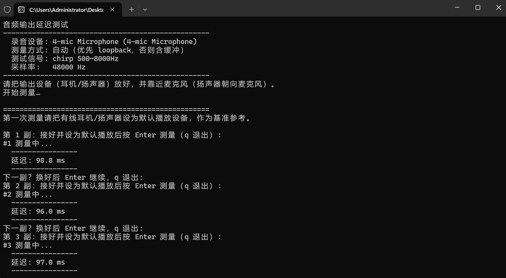

# Audio-Latency

测量“音频输出 → 麦克风”延迟的 Windows 工具，支持有线/无线音频设备。

延迟 = 麦克风采集时间点 - 音频流离开系统的时间点（蓝牙则是准备进入蓝牙协议栈的时间点）。

部分USB麦克风因内部USB Audio Class 缓冲、驱动缓冲或DSP/监听处理会带来较高的延迟，可测量后自行减去或使用`--mic-latency <ms>`选项。直入声卡ADC的麦克风，如3.5mm麦克风所测则相对准确。



## 快速开始

```bash
node index.js            # 引导式测量（默认）
node index.js --list     # 列出麦克风设备
```

打包版：`dist\latency.exe`（双击运行）或 `node dist\latency.min.js`。

## 引导式流程

1. **第一次测量请用有线耳机/扬声器**作为基准参考，扬声器靠近麦克风，按 Enter。
2. 程序测出有线基准：loopback N 次得 `延迟`（loopback 抓取点 → 麦克风）、mic N 次得 `含缓冲`（播放启动 → 麦克风）、`偏移 = 含缓冲 − 延迟`。
3. 之后每副设备按 Enter 测量：
   - 先试 loopback（最多 N 次），延迟合理 → 直接给出 `延迟`；
   - 否则（如蓝牙）→ mic N 次，用 `延迟 = 含缓冲 − 偏移` 计算。
   - N 默认 3，可用 `--times <n>` 覆盖。
   - 某次测量无效会自动补测 1 次；连续 3 次无效则停止，并对已有有效值取平均（全部无效则按无效处理）。
   - loopback 结果至少要有 2 个有效值才会采信；只有 1 个有效值或全部无效时，该设备按“不支持 loopback”处理。
4. 每副输出：`延迟: X ms`；加 `--print-latency` 时额外显示 `(含缓冲 Y ms，偏移 Z ms)`。

过程行默认不打印，加 `--print-latency` 可查看每次测量值（含显著性、相关性）。

## 全部选项


| 选项                      | 说明                                                                                         |
| ------------------------- | -------------------------------------------------------------------------------------------- |
| `--list`                  | 列出麦克风设备                                                                               |
| `--ffmpeg <path>`         | 指定 ffmpeg.exe 路径（否则按`FFMPEG_PATH` / 可执行文件同目录 / `PATH` / 默认目录查找）       |
| `--ffplay <path>`         | 指定 ffplay.exe 路径（否则按`FFPLAY_PATH` / 可执行文件同目录 / `PATH` / 同 ffmpeg 目录查找） |
| `--input <device>`        | 指定录音（麦克风）设备名，见`--list`                                                         |
| `--times <n>`             | 测量次数（非引导默认 5，引导默认 3；引导模式下也会生效）                                     |
| `--reference <ms>`        | 参考基线延迟（ms）。输出链路净延迟 = 测得值 − 基线                                          |
| `--lead <seconds>`        | chirp 前导静音时长（默认 2.0，覆盖链路唤醒）                                                 |
| `--rate <hz>`             | 采样率（默认 48000）                                                                         |
| `--min-quality <q>`       | 波形相关辅助阈值 0..1（默认 0.10）                                                           |
| `--min-significance <s>`  | 峰值显著性阈值（默认 20，主判据）                                                            |
| `--audio <file>`          | 用音频文件代替 chirp 作为测试信号                                                            |
| `--playback-latency <ms>` | 播放器开销（ffplay/SDL 缓冲），从结果中扣除                                                  |
| `--mic-latency <ms>`      | 麦克风固有延迟（如 USB 麦克风），从结果中扣除                                                |
| `--loopback`              | 强制 WASAPI loopback 双路模式（输出→麦克风净延迟）                                          |
| `--no-loopback`           | 旧模式：播放启动→麦克风（含播放缓冲，数值偏大）                                             |
| `--no-guided`             | 关闭引导式流程（默认开启）                                                                   |
| `--print-latency`         | 打印每次测量的延迟过程行（含显著性、相关性）                                                 |
| `--keep`                  | 保留临时 WAV 文件（调试用）                                                                  |
| `--no-pause`              | 运行结束后不暂停（默认“按任意键继续”）                                                     |
| `--help`, `-h`            | 显示帮助                                                                                     |

## 测量原理

播放一段已知的 chirp（默认 500~8000Hz），用 GCC-PHAT 互相关定位到达时刻：

- **loopback 模式**：同时抓系统输出(loopback)与麦克风，两路 chirp 位置差 = 输出→麦克风延迟，播放缓冲自动消掉。初始化失败会等待 800ms 重试（最多 3 次），仍失败才判定该设备不支持 loopback。loopback 通道以渲染端点 QPC 为精细时间轴，再用“读包时刻 − QPC”的中位数做常量校正，既避免蓝牙渲染端点 QPC 带链路缓冲偏差导致差值接近 0，又保持 loop 波形相关处于较高水平。
- **含缓冲模式**：用 ffplay 音频时钟与麦克风到达时刻相减，含播放缓冲，用于计算偏移/差分。

有效判据：峰值显著性 ≥ 20（默认）且波形相关 ≥ 0.10；loopback 模式额外要求延迟在 5~500ms，且 loop 通道至少满足其一：`loop相关 ≥ 0.9`、`loop显著性 ≥ 50`、或 `mic显著性 ≥ 50 且 mic相关 ≥ 0.5`。

计算波形相关前会先做 **400~4000Hz 带通滤波**，抑制低频噪声与高频编码失真，让 NCC 更稳定、更不容易掉到 0.10 以下。

波形相关（普通相关 / loop相关）在计算前会先做 **±200ppm 采样时钟偏移补偿**：在 chirp 定位点附近搜索最佳重采样比，把播放/录音时钟偏差带来的频偏消掉，再算 NCC，因此相关性比直接计算更接近真实波形相似度。

## 构建

```bash
npx esbuild index.js --bundle --platform=node --format=esm --minify --outfile=dist/latency.min.js
```

更多细节见 [docs/glossary.md](docs/glossary.md) 与 [docs/architecture.md](docs/architecture.md)。
